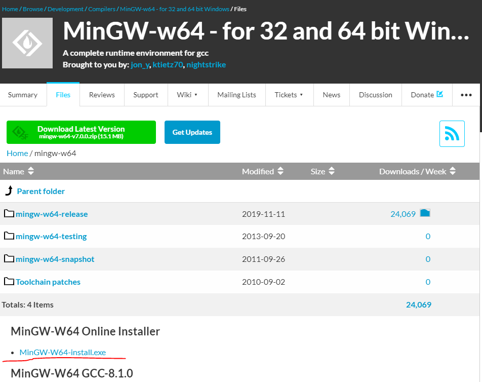
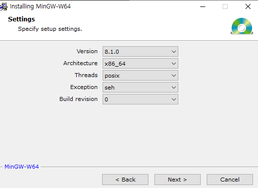
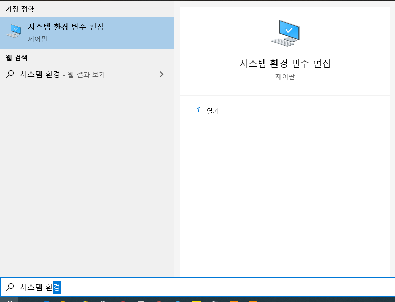
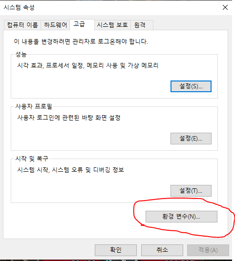
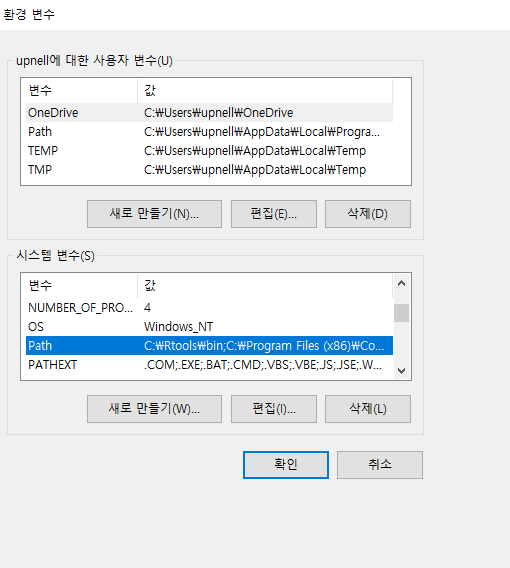

VS Code 윈도우 C / C++ 컴파일 환경설정하기
[트러블 기록](./trouble.md)

https://webnautes.tistory.com/1158

[VS Code 다운로드 링크](https://code.visualstudio.com/#alt-downloads)

[C/C++컴파일러](https://sourceforge.net/projects/mingw-w64/files/mingw-w64/ ) 

