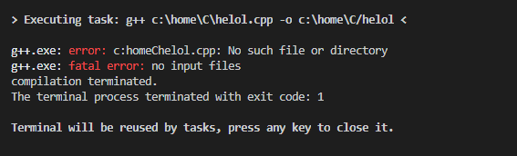

VS code 에서 c/c++ 환경 구성을 따라하는 도중 문제 발생

c++ 컴파일 안되는 문제




다음과 같이 수정해줌
```json
"args": [
                "${fileBasenameNoExtension}.cpp",
                "-o",
                "${fileBasenameNoExtension}.exe"
            ]
```

